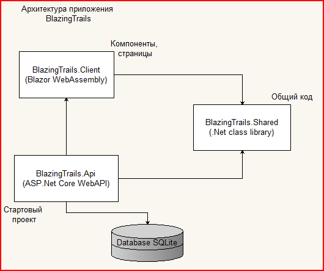

# BlazorExample
Example from book Blazor in action.
Source: https://github.com/chrissainty/blazor-in-action/

ISBN: 978-5-93700-179-5

Для сборки требуется Node.js версии 16. Сборка на версии 8 приводит к ошибкам. Если требуется взаимодействовать с несколькими версиями Node, отличным решением является менеджер NVM: https://github.com/nvm-sh/nvm